<picture>
  <source media="(prefers-color-scheme: dark)" srcset="profile_sysfetch_dark.svg">
  <source media="(prefers-color-scheme: light)" srcset="profile_sysfetch_light.svg">
  
</picture>
<picture>
  <source media="(prefers-color-scheme: dark)" srcset="profile_3d_ascii_dark.svg">
  <source media="(prefers-color-scheme: light)" srcset="profile_3d_ascii_light.svg">
  
</picture>

[](https://holopin.io/@yugalbansal)

## Featured Projects

<sub>Source is private. Every project below is live.</sub>

<table>
  <tr>
    <td width="50%" valign="top">
      <h3>Vector Mind AI</h3>
      AI study platform with a 3-layer RAG pipeline: chat with your documents, voice tutoring, and one-click JSONL dataset generation from PDF, DOCX and PPTX for LLM fine-tuning.
      <br/><br/>
      <a href="https://vectormind.site"></a>
    </td>
    <td width="50%" valign="top">
      <h3>Autofy</h3>
      Workflow automation platform. Connect Gmail, Slack, Calendar and Notion, add an AI step, and run it on triggers from a visual drag-and-drop builder.
      <br/><br/>
      <a href="https://autofy-g1.netlify.app"></a>
    </td>
  </tr>
  <tr>
    <td width="50%" valign="top">
      <h3>ArchSight</h3>
      Code architecture intelligence. Connect a repo and it parses the backend AST to map dependencies and flag god services, circular dependencies and hidden coupling.
      <br/><br/>
      <a href="https://archsight.vercel.app"></a>
    </td>
    <td width="50%" valign="top">
      <h3>Utkarsh</h3>
      Mentorship-driven engineering cohort LMS with tracks, weekly code assignments, mentor reviews, and attendance and progress tracking.
      <br/><br/>
      <a href="https://utkarshpro.vercel.app"></a>
    </td>
  </tr>
</table>

## About Me

```typescript
const yugal = {
    location: "India 🇮🇳",
    education: "B.E. Computer Science (2024 - ongoing)",
    currentFocus: ["AI Platforms", "Web3 DApps", "IoT Systems"],
    communities: ["HackIndia 2025", "LeetCode", "Open Source"],
    funFact: "I automate everything I do more than twice"
};
```

- 🔭 Currently building **AI-powered platforms** and **Blockchain DApps**
- 🌱 Deep diving into **Smart Contracts**, **Edge Functions**, and **Embedded Systems**
- ⚡ Passionate about **scalable architecture** and **developer experience**
- 🏆 Winner of a coding competition and **Web Crafter 2.0**

## Tech Stack

| | |
|---|---|
| **Languages** |       |
| **Frontend** |     |
| **Backend & DB** |     |
| **Web3** |   |
| **Cloud & DevOps** |    |
| **IoT & Hardware** |   |

## More Work

- **Decentralized Attendance DApp** ([AttendCo](https://github.com/yugalbansal/AttendCo)): MetaMask auth and Ethereum smart contracts
- **Food Spoilage Monitor** ([dashboard](https://github.com/yugalbansal/foodSpoiler_Dashboard)): ESP32, MQ-135 and DHT11 sending real-time alerts through Supabase
- **file-tracker** ([repo](https://github.com/yugalbansal/file-tracker)): Git-style file change tracker in C with Merkle trees and hashing

## Connect

[](https://linkedin.com/in/yugalbansal1)
[](mailto:bansalyugal3@gmail.com)
[](https://discord.gg/yugalbansal)
[](https://instagram.com/bansalyugal_1)
[](https://buymeacoffee.com/yugalbansal)

> *"The best error message is the one that never shows up."*: Thomas Fuchs
